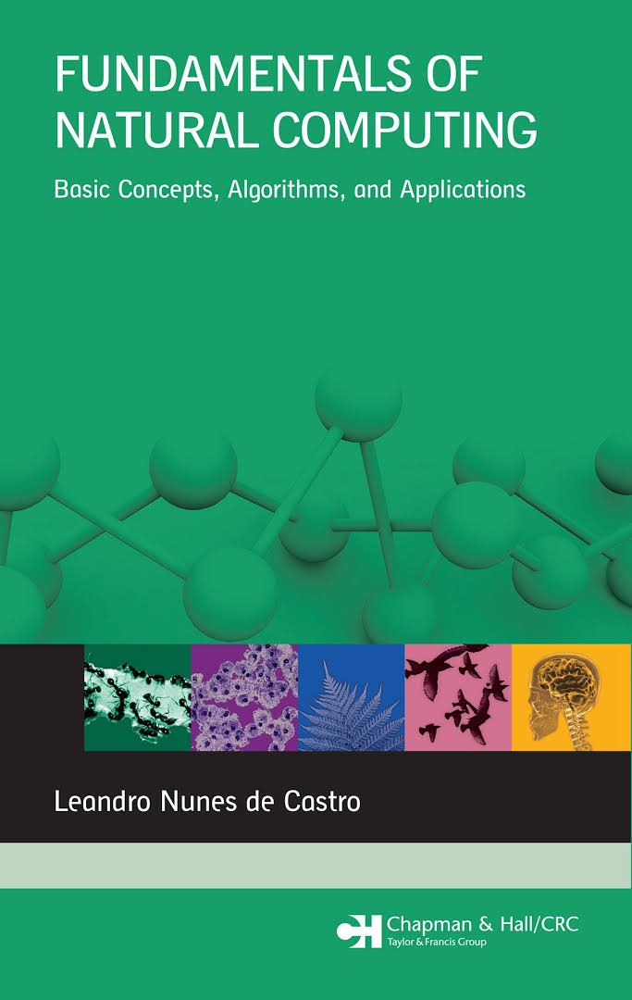

# NaturalComputingClass

This public repository is dedicated to the Natural Computing class. All experiments are conducted solely for research purposes and are not intended for commercial use or publication without proper authorization.

Natural computing is an interdisciplinary field that draws inspiration from nature to develop computational systems and algorithms. It encompasses a variety of subfields, each inspired by different natural phenomena.

# Current Reference of Work
The notebook for current programming work [Scheduler Experiment](NaturalComputingCourse\5_Experiment\SchedulerExperiment.ipynb)
is a interesting process mapping and task schedulling experiment visualization.

The [Imunologic Notebook](NaturalComputingCourse\4_Imunologic\Imunologic.ipynb) have some interesting data comparisons for the [Zoo Dataset](https://archive.ics.uci.edu/dataset/111/zoo)

## Branchs Patterns

### Genetic Algorithms
- **Prefix:** `gen/<name>`

### Neural Networks
- **Prefix:** `neural_net/<name>`

### Swarm Intelligence
- **Prefix:** `swarm/<name>`

### Immunological Computation
- **Prefix:** `immunologic/<name>`

### Article
- **Prefix:** `article/<name>`

## Course Information

### Studied Topics

1. **Course Introduction/Basic Concepts**
    - Overview of the course and fundamental concepts of natural computing.
    
2. **Evolutionary Computation/Genetic Algorithms**
    - Study of evolutionary computation and genetic algorithms, including their principles and applications.
    - Inspired by the process of natural selection, evolutionary computation involves algorithms like genetic algorithms, genetic programming, and evolutionary strategies.
    - These algorithms evolve solutions to optimization and search problems over successive generations.
    
3. **Artificial Neural Networks**
    - Introduction to artificial neural networks, covering basic structures and learning algorithms.
    - Modeled after the human brain, artificial neural networks consist of interconnected nodes (neurons) that process information in a manner similar to biological neural networks.
    - They are widely used in machine learning for tasks such as classification, regression, and pattern recognition.
    
4. **Swarm Intelligence**
    - Exploration of swarm intelligence, including algorithms inspired by the collective behavior of social insects.
    - This area is inspired by the collective behavior of social insects like ants, bees, and birds.
    - Algorithms such as ant colony optimization and particle swarm optimization mimic these behaviors to solve complex problems through decentralized, self-organized systems.
    
5. **Immunological Computation**
    - Study of immunological computation, which uses principles from the immune system to solve computational problems.
    - Drawing from the principles of the immune system, immunological computation involves algorithms that mimic the adaptive and self-organizing properties of biological immune systems.
    - These algorithms are used for anomaly detection, optimization, and learning
    
6. **Parametric Analysis and Result Evaluation**
    - Techniques for parametric analysis and evaluation of computational results.

7. **Fractals and Cellular Automata**
    - Overview of fractals and cellular automata.
    - Fractals are complex geometric shapes that can be split into parts, each of which is a reduced-scale copy of the whole.
    - Cellular automata are discrete models consisting of a grid of cells, each in one of a finite number of states. Both concepts are used to model natural phenomena and complex systems.

8. **Quantum Computing**
    - Introduction to quantum computing, covering basic concepts and potential applications.
    - Quantum computing leverages the principles of quantum mechanics to process information in fundamentally new ways.
    - Quantum computers use qubits, which can represent and process multiple states simultaneously, offering the potential for solving certain problems much faster than classical computers.
     
9. **Seminar Presentations/Article Submission**
     - Presentation of seminars and submission of article.

### Recommended Textbook

- **Title:** Fundamentals of Natural Computing: Basic Concepts, Algorithms, and Applications
- **Author:** Leandro Nunes de Castro
- **Publisher:** Chapman & Hall/CRC
- **Edition:** 1ª Edição
- **Availability:** Available in the campus library

